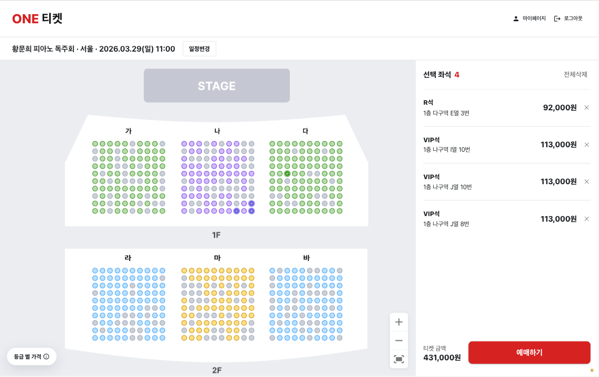

# 티켓예매사이트(ONE TICKET)




## 1. 프로젝트 소개

ONE TICKET은 사용자가 공연 정보를 탐색하고 상세 정보를 확인한 뒤, 좌석 선택과 예매 단계까지 자연스럽게 이어갈 수 있도록 설계한 티켓 예매 서비스입니다.

공연 탐색 경험과 실시간 좌석 선택 기능에 집중해, 빠르고 직관적인 예매 흐름을 제공하는 웹 서비스입니다.


## 2. 팀 정보

<table>
  <tr>
    <th>Frontend</th>
    <th>Backend</th>
  </tr>
  <tr>
    <td align="center">
      <a href="https://github.com/sealkimm">HEEWON</a>
    </td>
    <td align="center">
      <a href="https://github.com/LeeHusung">HUSUNG</a>
    </td>
  </tr>
</table>


## 3. 배포 링크 / 데모

- **Demo**: 배포 URL 업데이트 필요


## 4. 주요 기능

### 공연 탐색

- 최신 공연과 오픈 예정 공연을 구분해 메인 화면에서 노출
- 장르, 지역, 정렬 조건 기반 공연 필터링 지원
- 무한 스크롤 기반 공연 목록 탐색 제공
  - 추가 데이터 로딩 시 스켈레톤 UI를 노출해 대기 경험을 완화

### 공연 상세

- 공연 정보, 예매 정보, 안내사항을 탭 형태로 구분해 제공
- 회차 및 좌석 등급 정보를 예매 패널과 연동
- 찜하기 기능과 마이페이지 연동 지원

### 로그인 및 사용자 상태

- Google / Kakao 소셜 로그인 지원
- 인증 상태에 따라 로그인, 마이페이지, 로그아웃 흐름 분기
  - 로그인하지 않은 사용자는 좌석 선택 및 예매 진행이 제한됨
- 토큰 재발급 및 인증 만료 처리 지원
  - 인증 만료 시 전역 상태를 정리해 비정상 세션 사용을 방지함

### 좌석 선택 및 예매

- 실시간 좌석 상태를 반영한 좌석 선택 기능 제공
- 다른 사용자의 좌석 점유 상태를 소켓 기반으로 동기화
  - 이미 다른 사용자가 점유한 좌석은 선택 불가 상태로 제어
- 확대/축소 및 이동이 가능한 SVG 좌석 맵 제공
- 좌석 선택 후 예매 단계로 이어지는 플로우 구성
  - 좌석을 선택하지 않으면 다음 단계로 진입할 수 없도록 제한

### 사용자 피드백

- 로딩, 에러, 빈 상태를 공통 UI로 일관되게 처리
- Snackbar로 주요 상태 안내


## 5. 기술 스택

### Frontend

- **Framework**: Next.js (App Router)
- **Library**: React
- **Language**: TypeScript
- **UI Library**: MUI
- **Styling**: Emotion
- **State Management**: Zustand
- **Server State**: TanStack Query
- **Carousel**: Embla Carousel
- **Zoom / Pan**: react-zoom-pan-pinch
- **Date Handling**: dayjs
- **Notifications**: notistack

### Realtime / Network

- **WebSocket**: STOMP.js + SockJS
- **API Communication**: Fetch API 기반 커스텀 API 레이어
- **Authentication**: Access Token 재발급 및 전역 인증 이벤트 처리

### Data Fetching

- **Prefetch / Hydration**: React Query + HydrationBoundary
- **Infinite Scroll**: Intersection Observer 기반 무한 스크롤
- **Data Caching**: staleTime, gcTime 설정 기반 캐싱 전략 적용

### Development Tools

- **Package Manager**: pnpm
- **Linting**: ESLint
- **Formatting**: Prettier
- **Type Checking**: TypeScript


## 6. 빠른 시작

### 설치

```bash
pnpm install
```

### 환경 변수 설정

프로젝트 루트에 `.env.local` 파일을 생성하고 아래 값을 설정합니다.

```bash
NEXT_PUBLIC_API_BASE_URL=YOUR_API_SERVER_URL
```

### 개발 서버 실행

```bash
pnpm dev
```

브라우저에서 [http://localhost:3000](http://localhost:3000) 으로 접속합니다.

### 프로덕션 빌드

```bash
pnpm build
pnpm start
```


## 7. 프로젝트 구조

```text
src
├── app                     # App Router 페이지 및 레이아웃
│   ├── (default)           # 일반 서비스 화면
│   └── (simple)            # 로그인/예매 등 단순 레이아웃 화면
├── components              # 공통 UI, 레이아웃, Boundary 컴포넌트
├── features
│   ├── auth                # 로그인/회원가입/인증
│   ├── booking             # 좌석 선택, 예매 플로우, 소켓 처리
│   ├── search              # 검색 UI
│   └── shows               # 공연 목록, 상세, 필터, 찜 기능
├── hooks                   # 공통 커스텀 훅
├── lib                     # API, QueryClient, env 등 공통 모듈
├── store                   # Zustand 전역 상태
├── styles                  # 글로벌 스타일 및 MUI 테마
└── types                   # 공통 타입
```


## 8. 실행 스크립트

```bash
pnpm dev
pnpm build
pnpm start
pnpm lint
```
